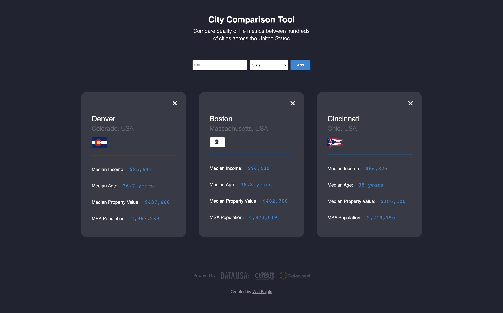

# City Comparison Tool

This city comparison tool is a basic single-page applicaiton that allows users to fetch US Census Bureau cost of living & quality of life metrics for nearly 30,000 US cities using the [datausa.io](https://datausa.io/about/api/) API.

## View

The application is optimized for desktop and can be accessed from your browser: [City Comparison Tool](https://winfeigle.github.io/phase-1-project/)

 

 

## Sources

- Format numbers as currency: https://stackoverflow.com/questions/149055/how-to-format-numbers-as-currency-strings

- Freeformatter: HTML State Selection Tool
  https://www.freeformatter.com/usa-state-list-html-select.html

- Data USA: US Census Bureau Data & API
  https://datausa.io/about/api/
